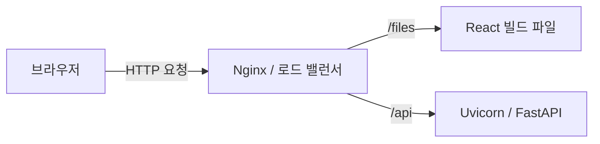

# 4. 배포 가이드 (Deployment Guide)

이 가이드는 Smh-Fassion을 로컬 개발 환경에서 프로덕션 서버로 이전하는 전략을 개략적으로 설명합니다.

## 프로덕션 아키텍처 (Production Architecture)
두 개의 별도 개발 서버를 실행하는 로컬 환경과 달리, 프로덕션은 일반적으로 프론트엔드를 정적 파일로 서빙하고 백엔드를 지속적인 서비스로 실행합니다.



## 1. 프론트엔드 빌드
React 프론트엔드는 정적 HTML/CSS/JS 파일로 컴파일되어야 합니다.

**명령어**:
```bash
cd frontend
npm run build
```
**출력**:
*   최적화된 정적 파일을 포함하는 `dist/` 디렉토리를 생성합니다.
*   이 파일들은 실행에 Node.js가 *필요하지 않으며*, 모든 웹 서버(Nginx, Apache, AWS S3)에서 서빙할 수 있습니다.

## 2. 백엔드 배포
Python 백엔드는 견고한 서버 환경이 필요합니다.

**단계**:
1.  **환경**: 서버에 Python 3.10 이상이 설치되어 있는지 확인합니다.
2.  **의존성**: `requirements.txt`에 명시된 특정 버전을 설치합니다.
3.  **프로세스 관리자**: API가 중단될 경우 재시작할 수 있도록 **Gunicorn**(Linux)을 사용하거나 시스템 서비스 관리자(systemd 또는 Docker)가 관리하는 **Uvicorn**을 계속 사용합니다.
    *   *예시 명령어*: `gunicorn -w 4 -k uvicorn.workers.UvicornWorker main:app`

## 3. 서버 설정 (예: Nginx)
이들을 연결하는 Nginx 설정 블록은 다음과 유사할 것입니다:

*   **루트 Root (/)**: `frontend/dist`를 가리킵니다. `index.html`을 서빙합니다.
*   **API (/process-image)**: 요청을 `127.0.0.1:8000`(FastAPI 실행 위치)으로 프록시합니다.

## 향후 고려사항
*   **API 속도 제한 (Rate Limiting)**: Gemini API에는 할당량이 있습니다. 프로덕션에서는 키 소진을 방지하기 위해 캐싱이나 속도 제한을 고려해야 합니다.
*   **보안**: `GEMINI_API_KEY`는 서버의 안전한 환경 변수로 주입되어야 하며, 절대 파일에 하드코딩되어서는 안 됩니다.
*   **HTTPS**: 특히 사용자 이미지 업로드를 처리할 때 보안을 위해 필수적입니다.
